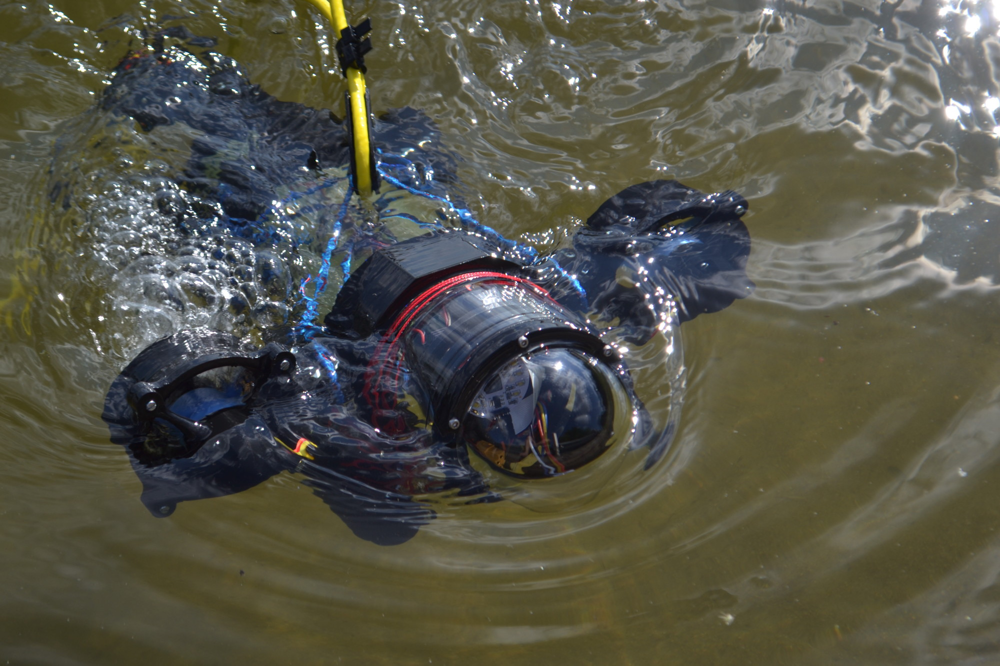
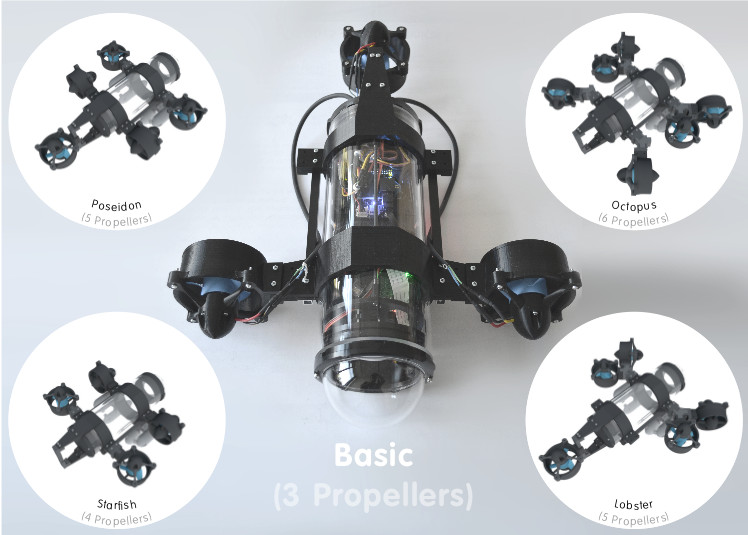
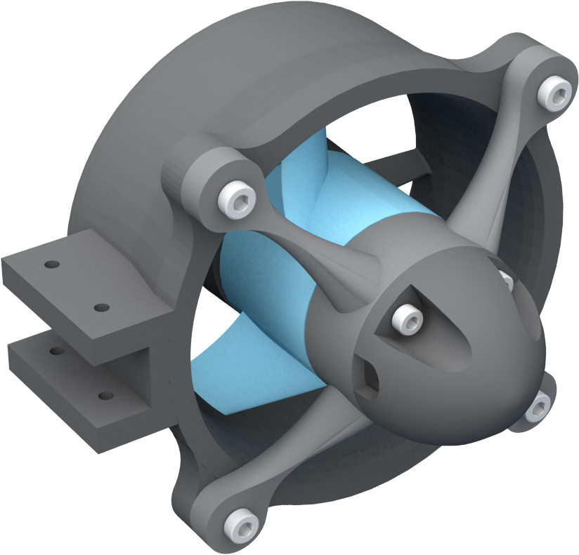

# A customisable underwater robot
This repository contains the open source 3D-printable models for a customisable underwater drone. The work and the models are described in the following arXiv publication:

Schillaci, G., Schillaci, F. and Hafner, V.V. A Customisable Underwater Robot, arXiv preprint arXiv:1707.06564. 2017. Link to the paper: <a href="https://arxiv.org/abs/1707.06564" target="_blank">https://arxiv.org/abs/1707.06564 </a>

For any feedback, please contact us:

<a href="https://adapt.informatik.hu-berlin.de/schillaci/" target="_blank">Guido Schillaci</a>: guido.schillaci at informatik.hu-berlin.de

<a href="http://www.schillaci.org/" target="_blank">Fabio Schillaci</a>: fabio at schillaci.org

See license and disclaimer information below.

# Instructions

The models provided here allows for multiple propeller and ballast configurations. They are compatible with the 4" watertight enclosure sold by <a href="https://www.bluerobotics.com/">BlueRobotics</a>. 

It is recommended to 3D print the objects with solid infill. 

## Thrusters
Thrusters (inspired on BlueRobotics thrusters) are compatible with Turnigy Aerodrive DST brushless motors (tested DST-700 and DST-1200, so far). Please note that the models provided here are not compatible with the M100 and M200 motors sold by BlueRobotics.

The following figures illustrate a mounted propeller and an exploded version showing its components.

The 3D printable files (.STL) of each component can be found in the Models folder. Starting from the bottom left object (not considering screws and nuts):

* thruster_main.stl

* propeller_dst_2_bluerov_adapter.stl

* propeller.stl: the propeller is a modification of the original T200 propeller developed by BlueRobotics, which can be ordered from Bluerobotics' store. The version provided here fits better with Turnigy DST motors.

* motor: the figure illustrate a Turnigy DST-700, not provided here

* thruster_motor_mount.stl: the motor is mounted on this X shaped component, which is then mounted onto the thurster main component. This mounts has holes compatible with DST motors. It has not been tested yet with Bluerobotics M100 or M200 motors, so it may be not compatible.

* thruster_cap.stl

# License and disclaimer
 The work and the models provided here have been created by Fabio Schillaci and Guido Schillaci and are licensed under a <a rel="license" href="http://creativecommons.org/licenses/by/4.0/">Creative Commons Attribution 4.0 International License</a>.

In no case shall the authors of this work be liable for any injury, loss, claim, or any direct, indirect, incidental, punitive, special, or consequential damages of any kind, including, without limitation lost profits, lost revenue, lost savings, loss of data, replacement costs, or any similar damages, whether based in contract, tort (including negligence), strict liability or otherwise, arising from your use of any of the models and the material provided here, or for any other claim related in any way to your use of the models and the material provided here, including, but not limited to, any errors or omissions in any content, or any loss or damage of any kind incurred as a result of the use of the models and the material provided. Because some states or jurisdictions do not allow the exclusion or the limitation of liability for consequential or incidental damages, in such states or jurisdictions, our liability shall be limited to the maximum extent permitted by law.
