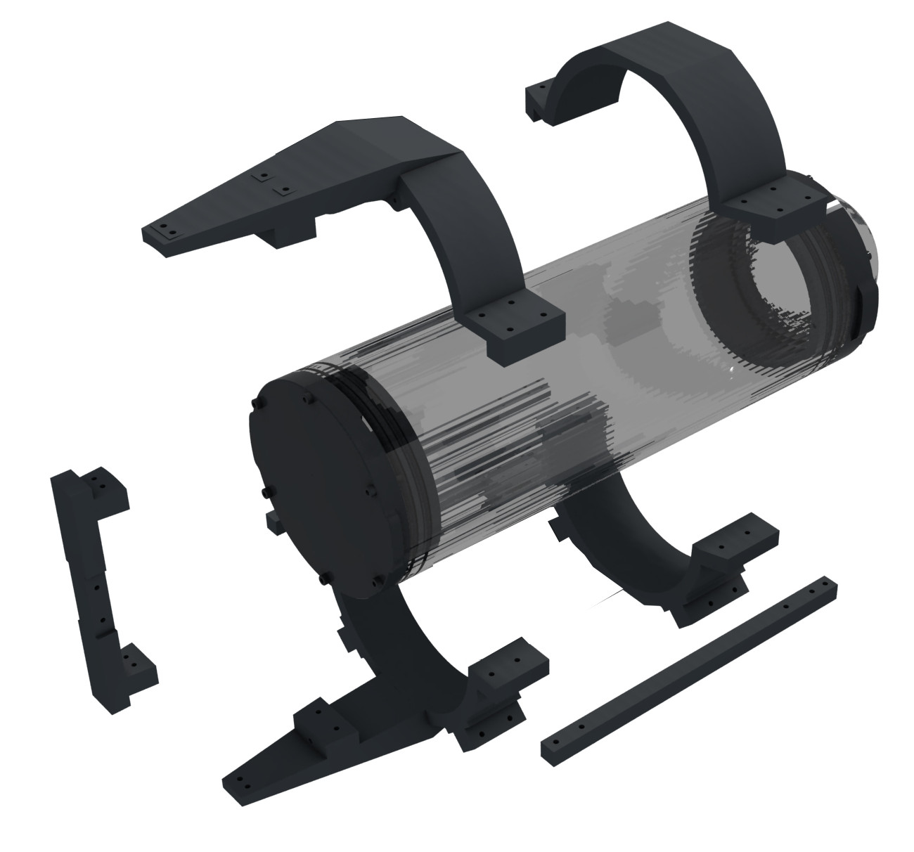
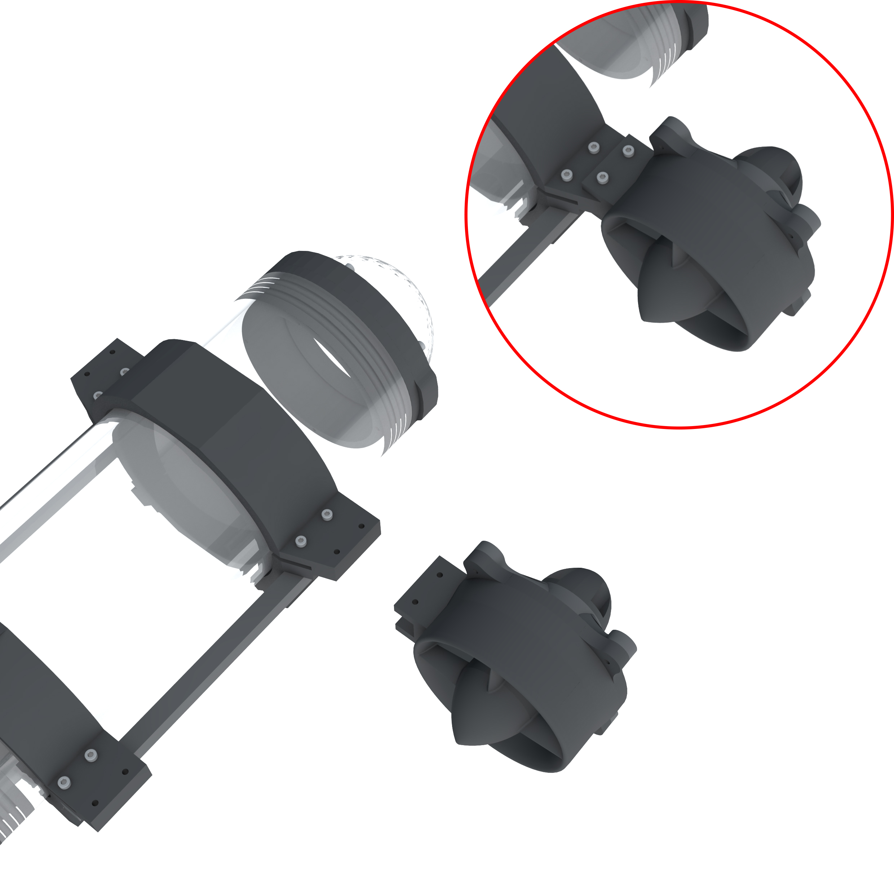
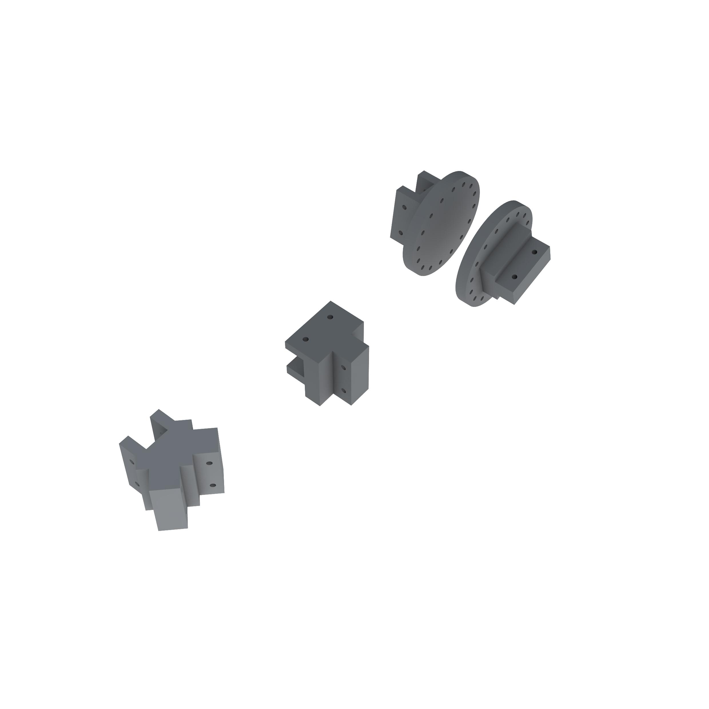
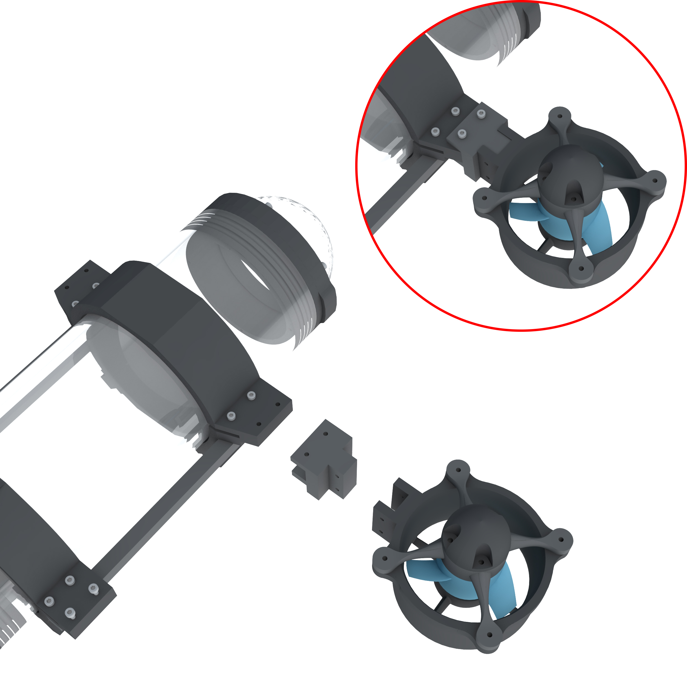
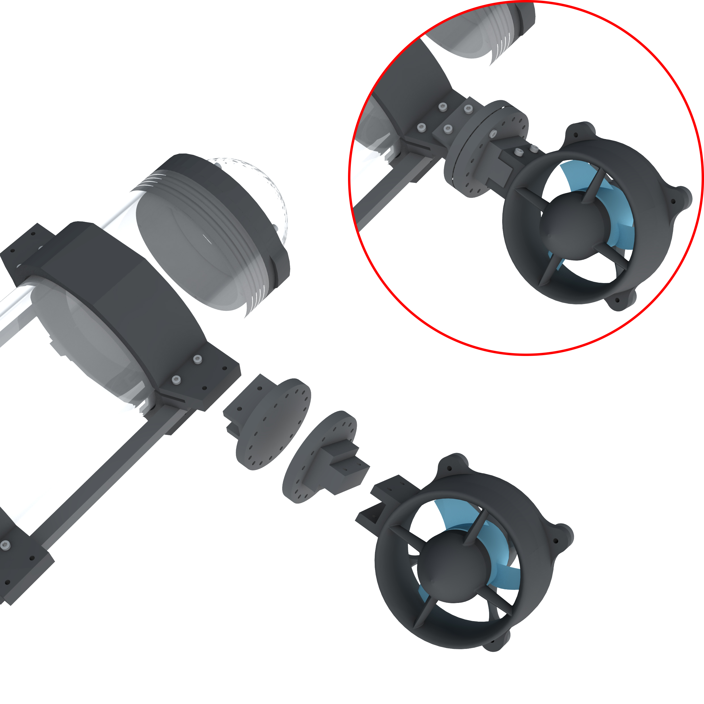
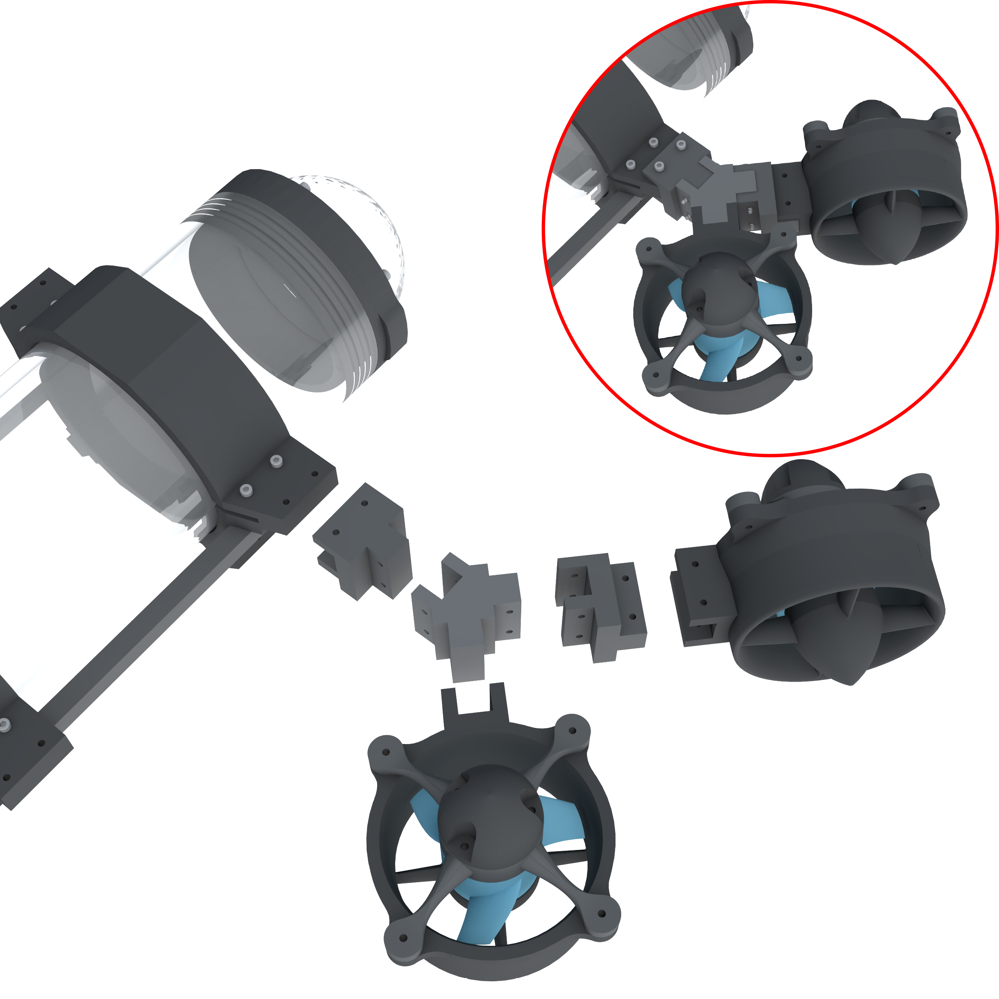

# A customisable underwater robot
This repository contains the open source 3D-printable models for a customisable underwater drone. The work and the models are described in the following arXiv publication:

Schillaci, G., Schillaci, F. and Hafner, V.V. A Customisable Underwater Robot, arXiv preprint arXiv:1707.06564. 2017. Link to the paper: <a href="https://arxiv.org/abs/1707.06564" target="_blank">https://arxiv.org/abs/1707.06564 </a>

For any feedback, please contact us:

<a href="https://adapt.informatik.hu-berlin.de/schillaci/" target="_blank">Guido Schillaci</a>: guido.schillaci at informatik.hu-berlin.de

<a href="http://www.schillaci.org/" target="_blank">Fabio Schillaci</a>: fabio at schillaci.org

See license and disclaimer information below.

# Instructions

The models provided here allows for multiple propeller and ballast configurations. They are compatible with the 4" watertight enclosure sold by <a href="https://www.bluerobotics.com/">BlueRobotics</a>. 

The 3D model files (step and igs) and 3D printable files (.stl) of each component can be found in the Models folder. 

It is recommended to 3D print the objects with solid infill. 

## Thrusters
Thrusters (inspired on BlueRobotics thrusters) are compatible with Turnigy Aerodrive DST brushless motors (tested DST-700 and DST-1200, so far). Please note that the models provided here are not compatible with the M100 and M200 motors sold by BlueRobotics.

The following figures illustrate a mounted propeller and an exploded version showing its components.

The objects are named in the Models folder as follows. Starting from the bottom left object (not considering nuts and bolts):

* thruster_main (.igs, .stp, .stl)

* propeller_dst_2_bluerov_adapter (.igs, .stp, .stl)

* propeller (.igs, .stp, .stl): the propeller is a modification of the original T200 propeller developed by BlueRobotics, which can be ordered from Bluerobotics' store. The version provided here fits better with Turnigy DST motors.

* motor: the figure illustrate a Turnigy DST-700. Model is not provided here

* thruster_motor_mount (.igs, .stp, .stl): the motor is mounted onto this X shaped component. The thruster_motor_mount is then mounted onto the thurster_main component. This mount has holes aligned with those of DST motors bases. It has not been tested yet with Bluerobotics M100 or M200 motors, so it may be not compatible.

* thruster_cap.stl (.igs, .stp, .stl)

## Clamps and posterior support

Two sets of clamps have been designed that allow easy customisation of thrusters and ballast configurations.

The model files are named as follows

* clamp_anterior_superior (.igs, .stp, .stl): the upper part of the anterior clamp. It has two mounting points (left and right) for motors, ballasts or adapters.

* clamp_anterior_inferior (.igs, .stp, .stl): the lower part of the anterior clamp. It has two mounting points (+45 degrees, -45 degrees) for motors, ballasts or adapters.

* stick (.igs, .stp, .stl): this stick can be screwed to both the posterior and anterior lower clamps. 

* clamp_posterior_superior (.igs, .stp, .stl): the upper part of the posterior clamp. It has two mounting points (left and right) for motors, ballasts or adapters. It has an additional structure for mounting the support for rear motors or ballasts. 

* clamp_posterior_inferior (.igs, .stp, .stl): the lower part of the posterior clamp. It has two mounting points (+45 degrees, -45 degrees) for motors, ballasts or adapters. It has an additional structure for mounting the support for rear motors or ballasts.

* rear_clamp_connector (.igs, .stp, .stl): it connects the two posterios clamps and provides an additional mounting point for a motor, ballast or adapter.

* posterior_clamp_2_tube_connector (.igs, .stp, .stl): this small elements allows to screw the posterior clamps (the same can be used for both the upper and lower parts) into the cap of the Bluerobotics watertight enclosure.

## Mounting points

Clamps and rear connector have several mounting points for motors, ballasts and adapters. 

For instance, a motor can be plugged onto a mounting point of the anterior clamp as in the following illustration:

We designed three adapters to allow rotating the original mounting point.

* adapter_90 (.igs, .stp, .stl): allows rotating the original mounting point of 90 degrees. It can be used, for instance, to mount a vertical thruster, as in the following illustration:

* adapter_round[_male, _female] (.igs, .stp, .stl): allows 5 different rotation angles within 90 degrees. It can be used, for instance, to mount a diagonal thruster, as in the following illustration:

* adapter_split (.igs, .stp, .stl): splits a mounting point into two, rotated at +45 and -45 degrees in respect to the original mounting point orientation. A combination of this and the previous adapters allows for a great number of possible thruster configurations, as in the example illustrated in the following figure.

## Ballast

We designed a ballast structure with mounting points compatibles with those described above. The structure is a cylinder that can be filled with ballast, such as stainless steel balls (we used 10mm steel ball; each ballast cylinder filled with these balls weighted around 300-400 grams).

The ballast structure is composed by a cylinder and two caps:

* ballast_cylinder (.igs, .stp, .stl): it has two separate compartments that can be filled to better set the center of mass of the drone. It has a mounting point that fits with those of the clamps and adapters

* ballast_cap (.igs, .stp, .stl): two caps have to be printed to close the cylinder on both sides.

# License and disclaimer
 The work and the models provided here have been created by Fabio Schillaci and Guido Schillaci and are licensed under a <a rel="license" href="http://creativecommons.org/licenses/by/4.0/">Creative Commons Attribution 4.0 International License</a>.

In no case shall the authors of this work be liable for any injury, loss, claim, or any direct, indirect, incidental, punitive, special, or consequential damages of any kind, including, without limitation lost profits, lost revenue, lost savings, loss of data, replacement costs, or any similar damages, whether based in contract, tort (including negligence), strict liability or otherwise, arising from your use of any of the models and the material provided here, or for any other claim related in any way to your use of the models and the material provided here, including, but not limited to, any errors or omissions in any content, or any loss or damage of any kind incurred as a result of the use of the models and the material provided. Because some states or jurisdictions do not allow the exclusion or the limitation of liability for consequential or incidental damages, in such states or jurisdictions, our liability shall be limited to the maximum extent permitted by law.
